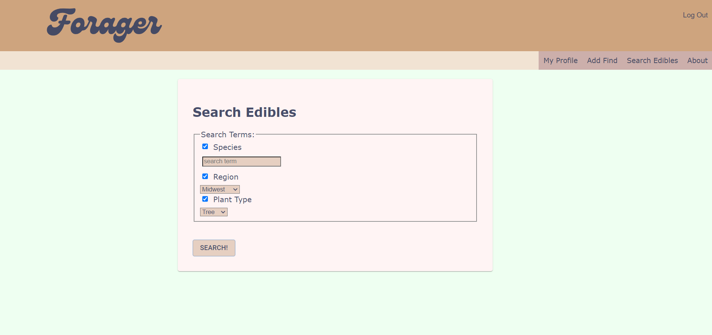

<a name="readme-top"></a>
<!-- PROJECT LOGO -->
<br />
<div align="center">
  <a href="https://github.com/halziebol11/forager-app">
    
  </a>

<h3 align="center">Forager</h3>

  <p align="center">
    Foragers have special spots they visit every year and are always looking for new wild edibles! On this app users input information —including the location and species along with a photo and notes— about their foraging spot. This data is stored on a map where they can view, edit and delete finds. When they input a new species, it counts toward foraging badges that a user can earn. Users can also search for species by region/name/growth type in the database and learn more about them!
    <br />
</div>


<!-- TABLE OF CONTENTS -->
<details>
  <summary>Table of Contents</summary>
  <ol>
    <li>
      <a href="#about-the-project">About The Project</a>
      <ul>
        <li><a href="#built-with">Built With</a></li>
      </ul>
    </li>
    <li>
      <a href="#getting-started">Getting Started</a>
      <ul>
        <li><a href="#prerequisites">Prerequisites</a></li>
        <li><a href="#installation">Installation</a></li>
      </ul>
    </li>
    <li><a href="#usage">Usage</a></li>
    <li><a href="#roadmap">Roadmap</a></li>
    <li><a href="#contributing">Contributing</a></li>
    <li><a href="#license">License</a></li>
    <li><a href="#contact">Contact</a></li>
    <li><a href="#acknowledgments">Acknowledgments</a></li>
  </ol>
</details>


<!-- ABOUT THE PROJECT -->
## About The Project

<p align="right">(<a href="#readme-top">back to top</a>)</p>

A list of technologies used to create Forager.

### Built With

* Node.js
* Express.js
* Axios
* PostgreSQL
* pgadmin
* React.js
* React-Redux
* Redux-Saga
* passport
* PostgreSQL
* HTML5
* CSS
* AWS
* Google Maps API
* Wikipedia API
* wtf_wikipedia
* Octoparse (data scraper)

<p align="right">(<a href="#readme-top">back to top</a>)</p>


## Getting Started

To get a local copy up and running follow these simple example steps.

### Prerequisites

1. Install the latest version of npm
* npm
  ```sh
  npm install npm@latest -g
  ```
2. Install Node.js

### Installation

1. Clone the repo
   ```sh
   git clone https://github.com/github_username/repo_name.git
   ```
2. Install NPM packages
   ```sh
   npm install
   ```
3. Get a Google Maps API Key at [Google Maps Platform](https://developers.google.com/maps/documentation/javascript/get-api-key)
4. Set up an AWS account at [Amazon Web Services](https://docs.aws.amazon.com/index.html) and create an S3 Bucket for the project.
4. Create a .env file and enter in your secret keys and variables.
   ```
    REACT_APP_GOOGLE_MAPS_KEY='ENTER YOUR GOOGLE MAPS API'
    AWS_ACCESS_KEY_ID='ENTER YOUR AWS ACCESS KEY ID HERE'
    AWS_SECRET_ACCESS_KEY='ENTER YOUR AWS SECRET ACCESS KEY HERE'
    AWS_REGION='ENTER AWS REGION'
   ```
5. Set up a database called `forager-app` and create the 7 tables as instructed in the database.sql file. Table data can be found [here] (https://tinyurl.com/forager-table-data).

6. Start the server by running the following command in your terminal
   ```sh
   npm run server
   ```
7. Start the client by running the following command in your terminal
   ```sh
   npm run client
   ```
8. The last command will open up a new tab in your browser.


<p align="right">(<a href="#readme-top">back to top</a>)</p>


<!-- USAGE EXAMPLES -->
## Usage

### Log Foraging Finds to Earn Badges

### View Your Finds


### Search for Wild Edibles By Name/Region/Growth Type



### Learn More About Your Foraging Finds


<p align="right">(<a href="#readme-top">back to top</a>)</p>


<!-- ROADMAP -->
## Roadmap

<!-- - [ ] Feature 1
- [ ] Feature 2
- [ ] Feature 3
    - [ ] Nested Feature -->


<p align="right">(<a href="#readme-top">back to top</a>)</p>


<!-- CONTRIBUTING -->
## Contributing

If you have a suggestion that would make this better, please fork the repo and create a pull request.

1. Fork the Project
2. Create your Feature Branch (`git checkout -b feature/AmazingFeature`)
3. Commit your Changes (`git commit -m 'Add some AmazingFeature'`)
4. Push to the Branch (`git push origin feature/AmazingFeature`)
5. Open a Pull Request

<p align="right">(<a href="#readme-top">back to top</a>)</p>


<!-- LICENSE -->
## License

Distributed under the MIT License.
<p align="right">(<a href="#readme-top">back to top</a>)</p>


<!-- CONTACT -->
## Contact

Haleigh - halziebol11@gmail.com

Project Link: [https://github.com/github_username/repo_name](https://github.com/halziebol11/forager-app)

<p align="right">(<a href="#readme-top">back to top</a>)</p>


<!-- ACKNOWLEDGMENTS -->
## Acknowledgments

* Thanks to Prime Digital Academy, especially Chris Black and Alex Bliss who equipped and helped me to make this application a reality. Thank you to my classmates for help debugging and implementing code!

* Plant species data scraped from the USDA <a href="https://plants.sc.egov.usda.gov/home">PLANTS Database</a> and the Lady Bird Johnson Wildflower Center of UTexas's <a href="https://www.wildflower.org/plants-main">Native Plants of North America Database</a> using <a href="https://www.octoparse.com/">Octoparse</a>.
      

<p align="right">(<a href="#readme-top">back to top</a>)</p>


<!-- MARKDOWN LINKS & IMAGES -->
<!-- https://www.markdownguide.org/basic-syntax/#reference-style-links -->
[stars-shield]: https://img.shields.io/github/stars/github_username/repo_name.svg?style=for-the-badge
[stars-url]: https://github.com/github_username/repo_name/stargazers
[issues-shield]: https://img.shields.io/github/issues/github_username/repo_name.svg?style=for-the-badge
[issues-url]: https://github.com/github_username/repo_name/issues
[license-shield]: https://img.shields.io/github/license/github_username/repo_name.svg?style=for-the-badge
[license-url]: https://github.com/github_username/repo_name/blob/master/LICENSE.txt
[linkedin-shield]: https://img.shields.io/badge/-LinkedIn-black.svg?style=for-the-badge&logo=linkedin&colorB=555
[linkedin-url]: https://linkedin.com/in/linkedin_username
[product-screenshot]: images/screenshot.png
